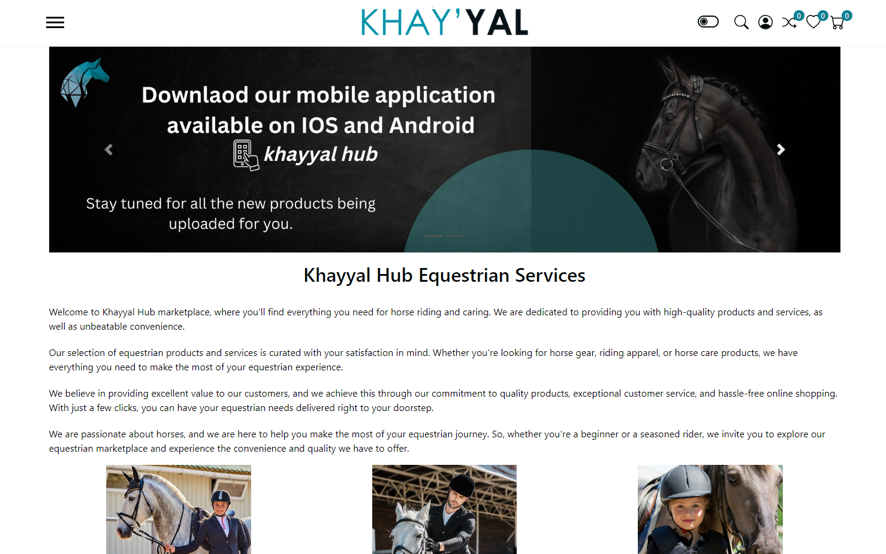

# Horsecare Marketplace Prototype

## Introduction
This project is a prototype for a service marketplace focused on horsecare professionals. It demonstrates proficiency in TypeScript, React, Supabase, CI/CD tools, and UI/UX principles.

## Architecture
The application is structured into two main parts:
- **Front-end**: Built with React and TypeScript, featuring components like LandingPage, SearchBar, etc.
- **Back-end**: Managed by Supabase, including tables for users, services, and bookings.
- **Payment Integration**: Uses Stripe for simulating booking transactions.

## Local Setup

1. **Clone the Repository**

git clone https://github.com/NightSkyHoney/react-supabase-horsecare-markeplace.git
cd horsecare-marketplace

2. **Install Dependencies**

npm install

3. **Environment Variables**
Set up the required environment variables in a `.env` file.

4. **Run the Application**

5. **Assumptions and Design Decisions**

Discuss any assumptions you made during development and explain your key design decisions. This could include your choice of libraries, database schema design, and UI/UX considerations.

## Assumptions and Design Decisions
- **UI/UX**: Focused on simplicity and mobile responsiveness.
- **Supabase**: Chosen for ease of setup and integrated authentication and database management.
- **React and TypeScript**: Utilized for their robust ecosystem and type safety features.

## Screenshots
